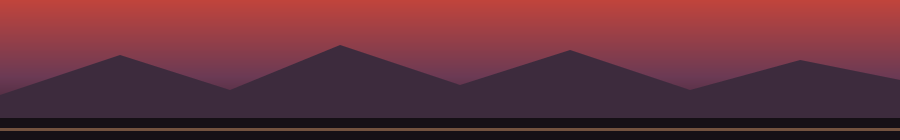

<!--
  Персональный pixel-art / synthwave-sunset профиль.
  Хочешь поменять текст HUD или ник — просто отредактируй строки ниже,
  никаких внешних данных подтягивать не нужно, всё лежит прямо в этом файле.
  Баннеры (assets/skyline.svg, assets/skyline-footer.svg) нарисованы вручную
  и хранятся в этом репозитории — не зависят от сторонних сервисов.
-->

<div align="center">


<br/>


</div>

<br/>

<div align="center">

### 🕹️ &nbsp;PLAYER LOG

</div>

```
> whoami
resccrew

> class
entrepreneur 

> current_quest
Building things worth shipping.

> inventory
[ espresso ]  [ claude code ]  [ velo ]  [ lock in ]
```

<br/>

<div align="center">

### 🐍 &nbsp;THE GRID


</div>

<br/>

<div align="center">




**`> GAME OVER? NOT YET.`**

</div>
