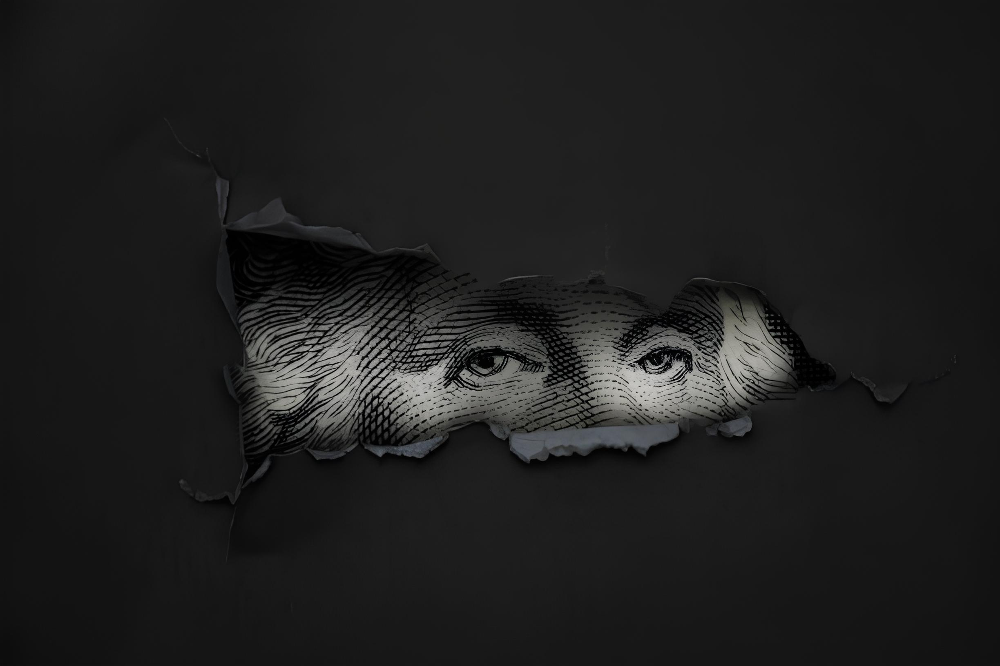
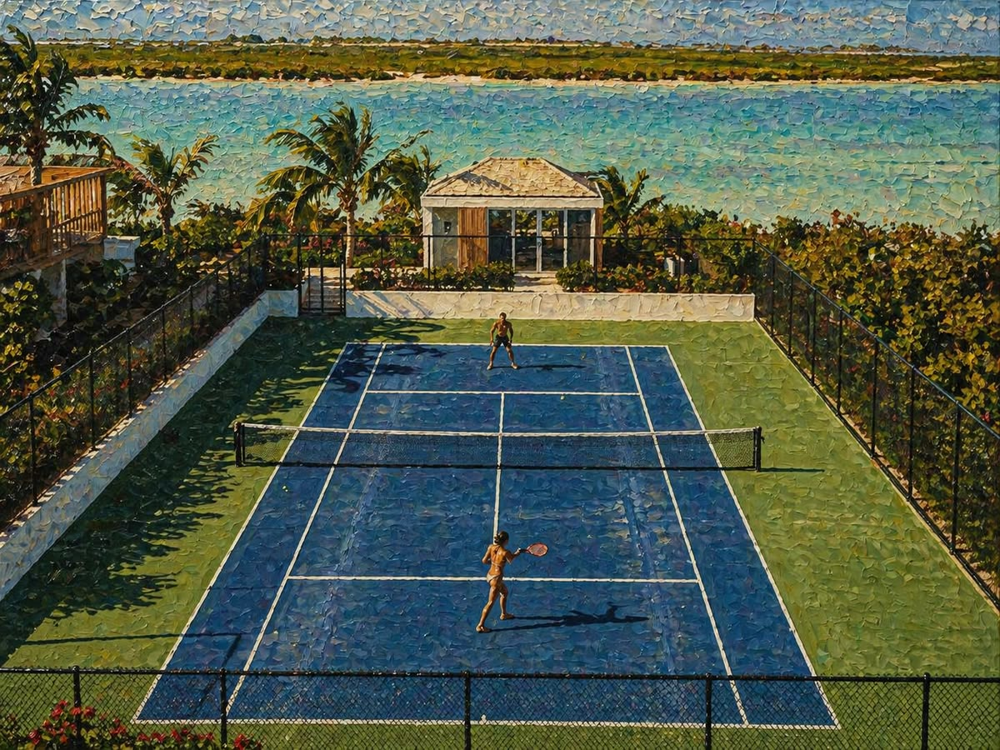
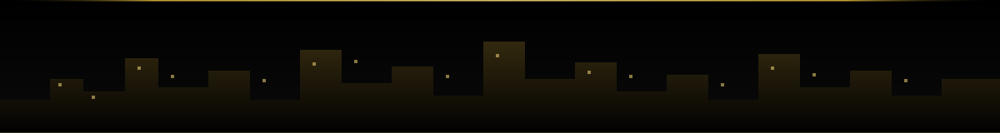

<!--
  New Money — dark, gold-accented profile theme.
  To change the headline text, edit the `lines=` parameter in the typing-svg URL below.
  Images live in assets/ and are hosted in this repo — no external image dependencies
  except the typing-svg and shields.io badge renderers.
-->

<div align="center">



</div>

<br/>

<div align="center">


</div>

<br/>

<div align="center">


</div>

<br/>

<div align="center">

### &nbsp;LOG

</div>

```
> whoami
resccrew

> role
entrepreneur

> current_focus
Building things worth shipping.

> toolkit
[ espresso ]  [ claude code ]  [ velo ]  [ lock in ]
```

<br/>

<div align="center">



<sub><i>built for the view, not the applause</i></sub>

</div>

<br/>

<div align="center">




**`> STILL BUILDING.`**

</div>
